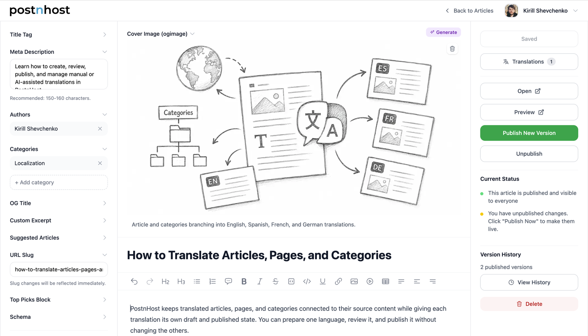

<h1 align="center" style="border-bottom: none">
  <div>
    <a href="https://postnhost.com">
      
      <br>
    </a>
  </div>
</h1>
<h3 align="center">
  SEO-ready multilanguage content engine for Rails.
</h3>
<p align="left">
PostnHost is an open source CMS engine built with Rails, Hotwire, and TailwindCSS. Write, translate, and publish articles with a rich text editor, full version history, and proper SEO that works out of the box.
</p>
<p align="left">
This repository is the <strong>self-hosted version</strong>: a Rails&nbsp;8 app built around the <a href="https://github.com/postnhost/postnhost">PostnHost engine</a>, packaged with SQLite, Solid Queue, Solid Cache, Litestream, and Tailwind. Install, generators, and overrides are covered in the <a href="https://github.com/postnhost/postnhost/blob/main/README.md">engine README</a>.
</p>



## Features

- 📝 **Rich Text Editor** - TipTap-based WYSIWYG editor
- 🌍 **Multilingual** - Translatable articles, i18n support, and locale-aware SEO metadata
- 🖼️ **Image Management** - Optimized multisize WebP everywhere
- 📊 **Version History** - Article versions history and rollback options
- 🤖 **Suggested Articles** - Manual picks plus automatic suggestions from related categories
- ⏰ **Post Scheduling** - Schedule publication in the chosen timezone
- 🌐 **Localized SEO** - Localized routes, language switcher, sitemap, and hreflang tags
- ⚙️ **Settings** - Manage the canonical site URL, pagination, key copy, and assets from the dashboard
- ⚡ **Hotwire-powered** - Fast, modern UI with Turbo Frames/Streams and Stimulus
- 🗃️ **Single SQLite database** - App data, Solid Cache, Solid Queue, and Action Cable in one file
- 🔄 **Backups** - Litestream replication to S3-compatible storage
- 🔐 **Session-based auth** - Built-in admin authentication
- 👥 **Authors** - Multiple CMS users, author profiles, and per-article co-author bylines

## Table of contents

- [Tech stack](#tech-stack)
- [Asset compatibility](#asset-compatibility)
- [Quick start](#quick-start)
- [Configuration](#configuration)
- [Customizing the host app](#customizing-the-host-app)
- [Robots.txt and sitemap](#robotstxt-and-sitemap)
- [Testing](#testing)
- [Production checklist](#production-checklist)
- [Docker development](#docker-development)
- [License](#license)

## Tech stack

| Component | Technology |
|-----------|-----------|
| Framework | Rails |
| Database | SQLite3 |
| Frontend | Hotwire (Turbo + Stimulus), TailwindCSS |
| Editor | Tiptap |
| File storage | CarrierWave (S3 compatible) |
| Background jobs | Solid Queue |
| Caching | Solid Cache |
| Backups | Litestream |

## Asset compatibility

This self-hosted application uses Propshaft for asset serving and Tailwind CSS for host overrides. Its CSS build combines engine and host view sources into one scoped `postnhost/application.css` that transparently overrides the packaged engine asset, so copied templates can use ordinary Tailwind classes without competing builds. The engine ships a prebundled JavaScript ES module.

The engine also supports Sprockets and host applications using import maps. See the [engine asset compatibility matrix](https://github.com/postnhost/postnhost#asset-compatibility) for details.

## Quick start

With the versions from `mise.toml` plus SQLite and libvips installed:

```sh
git clone https://github.com/postnhost/postnhost-app.git
cd postnhost-app
mise install
gem install bundler
corepack enable
bin/setup
```

The `packageManager` field in `package.json` makes Corepack use the repository's pinned Yarn version. No global Yarn installation is required.

### Database seeds

#### Seeding the database

- **`bin/rails db:seed`**
  Loads required reference data from `db/seeds.rb`:
  - Adds **9** `Language` records (English default, plus French, German, Japanese, Korean, Portuguese, Polish, Spanish, Russian)

If there are no CMS users yet, visit **`/onboarding`** to set up the first admin.
Sample categories and articles are optional and can be added from that setup flow after the administrator account is created.

Alternatively, create a CMS user interactively from the terminal:

```sh
bin/rails g postnhost:user
```

The generator prompts for the name, email, password, and password confirmation.

Full local setup, architecture, backup/restore, and troubleshooting: [DEVELOPMENT.md](DEVELOPMENT.md).

## Configuration

### PostnHost engine (`Postnhost.configure`)

Edit `config/initializers/postnhost.rb`:

```ruby
Postnhost.configure do |config|
  # Optional

  # config.site_url = "https://example.com"
  # config.public_page_size = 12
  # config.default_timezone = "UTC"
  # config.openai_api_key = "sk-..."
  # config.openai_gpt_model = "gpt-5.6-luna"
  # config.aws_access_key_id = "AKIA..."
  # config.aws_secret_access_key = "..."
  # config.aws_region = "us-east-1"
  # config.aws_bucket = "my-bucket"
  # config.aws_endpoint_url_s3 = "https://fly.storage.tigris.dev"
end
```

The initializer provides defaults for site URL, pagination, and timezone. Values saved under **Dashboard → Settings** take priority. If both site URL sources are blank, public URLs use the incoming request origin.

### Internationalization (i18n)

For localized public pages (`/:locale`, language switcher, `postnhost.public` strings), configure I18n in `config/application.rb`. **You must set English as the fallback locale** so any key missing in a non-English YAML file still resolves (engine + host locale files are merged; gaps should fall back to English):

```ruby
config.i18n.default_locale = :en
config.i18n.available_locales = %i[en fr de ja ko pt pl es ru] # add codes as you add Language records and locale files
config.i18n.fallbacks = [:en]
```

Without `config.i18n.fallbacks = [:en]`, visitors can see missing translations or blank UI where a locale file omits a key. See [Host app i18n](https://github.com/postnhost/postnhost#host-app-i18n-optional) in the engine README for locale files and `bin/rails g postnhost:locale`.

### Credentials (engine defaults + optional Litestream)

```sh
bin/rails credentials:edit
```

```yaml
postnhost:
  openai_access_token: ...
  openai_gpt_model: gpt-5.6-luna
  aws_access_key_id: AKIA...
  aws_secret_access_key: ...
  aws_region: us-east-1
  aws_bucket_name: my-bucket
  aws_endpoint_url_s3: https://s3.us-east-1.amazonaws.com

  # Optional: Litestream SQLite backups
  litestream_bucket: your-backup-bucket
  litestream_endpoint: fly.storage.tigris.dev
```

## Customizing the host app

- **Views** — `bin/rails g postnhost:views --views-scope=minimal` or `--views-scope=full` (copies to `app/views/postnhost/`). Add ordinary Tailwind classes and keep the CSS watcher running through `bin/dev`. Details are under [Customizing templates](https://github.com/postnhost/postnhost#customizing-templates) in the gem README.
- **Favicon and PWA icons** — Replace files under `public/`; see [Replacing favicon](https://github.com/postnhost/postnhost#replacing-favicon).
- **Logo / default OG image** — Dashboard settings and/or assets; brand files for this repo live under `app/assets/images/` (for example `logo.webp`, `og-image.webp`).
- **i18n and static pages** — See [Host app i18n](https://github.com/postnhost/postnhost#host-app-i18n-optional) and [Static pages](https://github.com/postnhost/postnhost#static-pages-terms-privacy-etc) in the gem README.

## Robots.txt and sitemap

Update `public/robots.txt` so `Sitemap:` matches your deployment. PostnHost generates `sitemap.xml` from live public content; URLs use the dashboard site URL when present, then `config.site_url`, then the incoming request origin.

Mounted at `/`:

```txt
Sitemap: https://your-domain.com/sitemap.xml
```

Mounted at `/blog`:

```txt
Sitemap: https://your-domain.com/blog/sitemap.xml
```

## Testing

**Host app** (from repository root):

```sh
bundle exec rspec spec/requests/engine_mount_smoke_spec.rb
bundle exec rspec spec/system/authentication_spec.rb spec/system/public/articles_spec.rb
```

Headless by default; visible browser:

```sh
SYSTEM_TESTS_BROWSER=1 bundle exec rspec spec/system
```

## Production checklist

Review these host-application settings before deployment:

- Review public template design and enable host Tailwind support for any new utility classes.
- Replace favicons and related icon files if needed.
- Update `public/robots.txt` with the production sitemap URL.
- Review the static `public/404.html` and `public/500.html` pages.
- Configure S3-compatible production uploads and Litestream backups, or replace those integrations.

## Docker development

With Docker Desktop or another Docker installation with Compose, run from the app repository:

```sh
docker compose up --build
```

Visit http://localhost:3000/onboarding. Local data persists between container restarts. See [DEVELOPMENT.md](DEVELOPMENT.md#docker-development) for details.

Build a production image with:

```sh
docker build -t postnhost-app .
```

The included `fly.toml` and Dockerfile support Fly.io deployments after you configure the application name, region, credentials, and persistent volume for your installation.

## License

Distributed under the MIT License. See [LICENSE](LICENSE).
